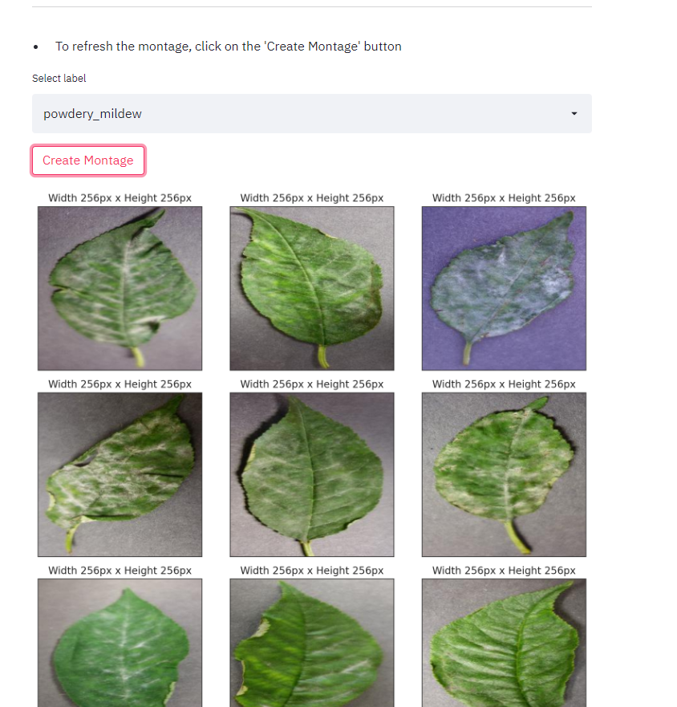

## Dataset Content
* The dataset contains +4 thousand images taken from the client's crop fields. The images show healthy cherry leaves and cherry leaves that have powdery mildew, a fungal disease that affects many plant species. The cherry plantation crop is one of the finest products in their portfolio, and the company is concerned about supplying the market with a compromised quality product.

## Business Requirements
The cherry plantation crop from Farmy & Foods is facing a challenge where their cherry plantations have been presenting powdery mildew. Currently, the process is manual verification if a given cherry tree contains powdery mildew. An employee spends around 30 minutes in each tree, taking a few samples of tree leaves and verifying visually if the leaf tree is healthy or has powdery mildew. If there is powdery mildew, the employee applies a specific compound to kill the fungus. The time spent applying this compound is 1 minute.  The company has thousands of cherry trees, located on multiple farms across the country. As a result, this manual process is not scalable due to the time spent in the manual process inspection.

To save time in this process, the IT team suggested an ML system that detects instantly, using a leaf tree image, if it is healthy or has powdery mildew. A similar manual process is in place for other crops for detecting pests, and if this initiative is successful, there is a realistic chance to replicate this project for all other crops. The dataset is a collection of cherry leaf images provided by Farmy & Foods, taken from their crops.

* 1 - The client is interested in conducting a study to visually differentiate a healthy cherry leaf from one with powdery mildew.
* 2 - The client is interested in predicting if a cherry leaf is healthy or contains powdery mildew.

## Hypothesis and how to validate?
* We suspect that the Mildew infected plants can be identified by white powdery spot on the leaves and stem.
    * How to validate : An image study can help to investigate it.
* It can be assumed that a working model could predict if the leaf is infected despite being provided with images in different orientations . 
    * How to validate : Using data augmentation before fitting the model to provide more data should give us the ability to predict different pictures
* We suspect that mildew could also be detected on other plants and leaves.
    * How to validate : collect an additional test set from plants other than cherry trees.

## The rationale to map the business requirements to the Data Visualisations and ML tasks
* **Business Requirement 1**: Data Visualization 
	* We will display the "Average" and "variablility" images for parasitised and uninfected leaves.
 	* We will display the difference between an average parasitised leaf and an average uninfected leaf.
	* We will display an image montage for either parasitised or uninfected leaves.

## ML Business Case
### MildewClf
* I intend to use a ML model to predict if a leaf is infected with mildew or not, Using historical image data. It is a supervised, single-label, 2-class, classification model.
* Our preferred result is to be able to provide the client with a reliable way to identify infected plants to prevent the client to unintentionally selling plants of poor quality.
* The model success metrics are:
    * Created a scalable method verify mildew infected trees faster than doing it manually.
* Heuristics: The current method to verify if a tree is infected by mildew is that an employee spends around 30 minutes to visually inspect every tree, And an additional minute to apply a compound to kill the fungus. This leaves room for inaccurate diagnostics due to human error. Due to the plantation having thousands of trees this is not possible to do regularly on all trees.
* Training data: 
    - Dataset has 4208 photos of cherry leaves both healthy and infected with [fungus](https://en.wikipedia.org/wiki/Powdery_mildew). Disease that affect wide range of plants however client interested to test on cherry trees initally. If successfull the project could be extended to other plants. All images was provided by the client
    - Dataset located on [Kaggle](https://www.kaggle.com/datasets/codeinstitute/cherry-leaves)
    - This project this fictious story for the developer to learn skill related to Machine Learning that could be applicable in the future in a real world setting.

## Dashboard Design
* Project summary
    
    * General information
        * Powdery mildew is a fungal disease that affects a wide range of plants.
        * Powdery mildew is one of the easier plant diseases to identify, as its symptoms are quite distinctive. Infected plants display white powdery spots on the leaves and stems.
    * Project Information
        * The cherry plantation crop from Farmy & Foods is facing a challenge where their cherry plantations have been presenting powdery mildew. Currently, the process is manual verification if a given cherry tree contains powdery mildew. An employee spends around 30 minutes in each tree, taking a few samples of tree leaves and verifying visually if the leaf tree is healthy or has powdery mildew. If there is powdery mildew, the employee applies a specific compound to kill the fungus. The time spent applying this compound is 1 minute.
        * The company has thousands of cherry trees, located on multiple farms across the country. As a result, this manual process is not scalable due to the time spent in the manual process inspection.
        * To save time in this process, the IT team suggested an ML system that detects instantly, using a leaf tree image, if it is healthy or has powdery mildew. A similar manual process is in place for other crops for detecting pests, and if this initiative is successful, there is a realistic chance to replicate this project for all other crops.
    * Business requirements
        * The Client has provided us with 2 requirements to fulfil during this project.
        * The client is interested in:
            * conducting a study to visually differentiate a healthy cherry leaf from one with powdery mildew.
            * predicting if a cherry leaf is healthy or contains powdery mildew.
  

* Data visualization
    * Leaf Visualizer
        * The client is interested in conducting a study to visually differentiates a healthy leaf from a infected leaf.
    * MultiSelect dropdown.
        * Allows to select visual representations including plots of the following:
            * Difference of the average and the variablity of the dataset
            * Differences between the average infected and average healthy leaves
            * Image montage of health and infected leaves

  

* ML performance
    * Train, Validation and Test Set: Labels Frequency
        * Barplot to show the distribution of health and infected in the train, validation and test set
        * Pieplot to show the distribution of health and infected in the train, validation and test set
    * Model History
        * Plots displaying the Model training history for both Accuracy and Losses.
    * Generalised Performance on Test Set.
  
    
  

* Project hypothesis
    * 
* Mildew detector
    * The client wants a tool for telling whether a leaf is infected by mildew or is healthy.
    * A downloadable set of the infected and healthy samples for live testing is available [here](https://www.kaggle.com/codeinstitute/cherry-leaves).
    * The page also has a file uploader to upload images of cherry leaves to analyse to determine if it is infected or not.
     

## Encounterd Bugs

* a new version of blinker which isnt compatible with the version of python was detected. added the specific version of blinker to the "requirements.txt"
## Unfixed Bugs

* None

## Deployment
### Heroku

* The App live link is: https://YOUR_APP_NAME.herokuapp.com/ 
* Set the runtime.txt Python version to a [Heroku-20](https://devcenter.heroku.com/articles/python-support#supported-runtimes) stack currently supported version.
* The project was deployed to Heroku using the following steps.

1. Log in to Heroku and create an App
2. At the Deploy tab, select GitHub as the deployment method.
3. Select your repository name and click Search. Once it is found, click Connect.
4. Select the branch you want to deploy, then click Deploy Branch.
5. The deployment process should happen smoothly if all deployment files are fully functional. Click now the button Open App on the top of the page to access your App.

## Main Data Analysis and Machine Learning Libraries
### Libraries
* numpy: Used to load images into an array to plot an average and variablity plot on it.
* pandas: Used for data cleaning, manipulating and analysis.
* matplotlib: utilized to create plots.
* seaborn: Used to visualize data.
* plotly: Creates interactive visualizations of data.
* streamlit: Used to create the dashboard for the project.
* scikit-learn: used to implement the machine learning model.
* tensorflow: Used to create the ML model
* keras: Used to create the ML model
### Technologies
* Python - programming language
* Heroku - used to host and deploy the project
* Kaggle - source for the Dataset
* CodeAnywhere - IDE
* Jupyter Notebook - used to illustrate the creation of the project

## Credits 

* Code from walkthrough project in predictive analytics was used from this [Repository] (https://github.com/Linber93/WalkthroughProject01)
* Alot of information was found using the documentations from the libraries above
* Assisted by 

### Content 

- The text for the Home page was taken from Wikipedia Article A.
- The general information about mildew was found on [Wikipedia](https://en.wikipedia.org/wiki/Powdery_mildew).

### Media

- Images used in the project were provided by the client

## Acknowledgements (optional)
* I want to thank my mentor Rohit for great input and feedback with this project